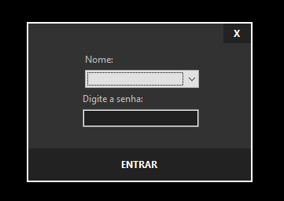
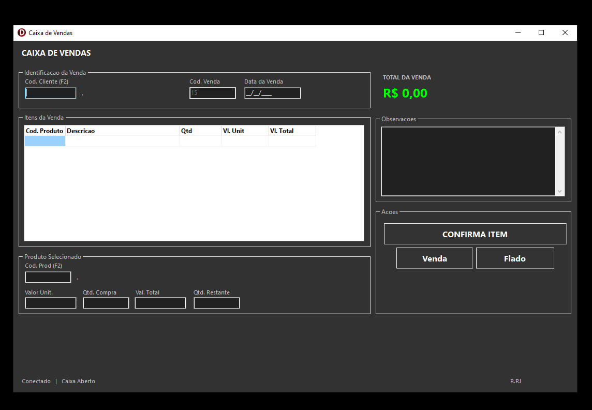
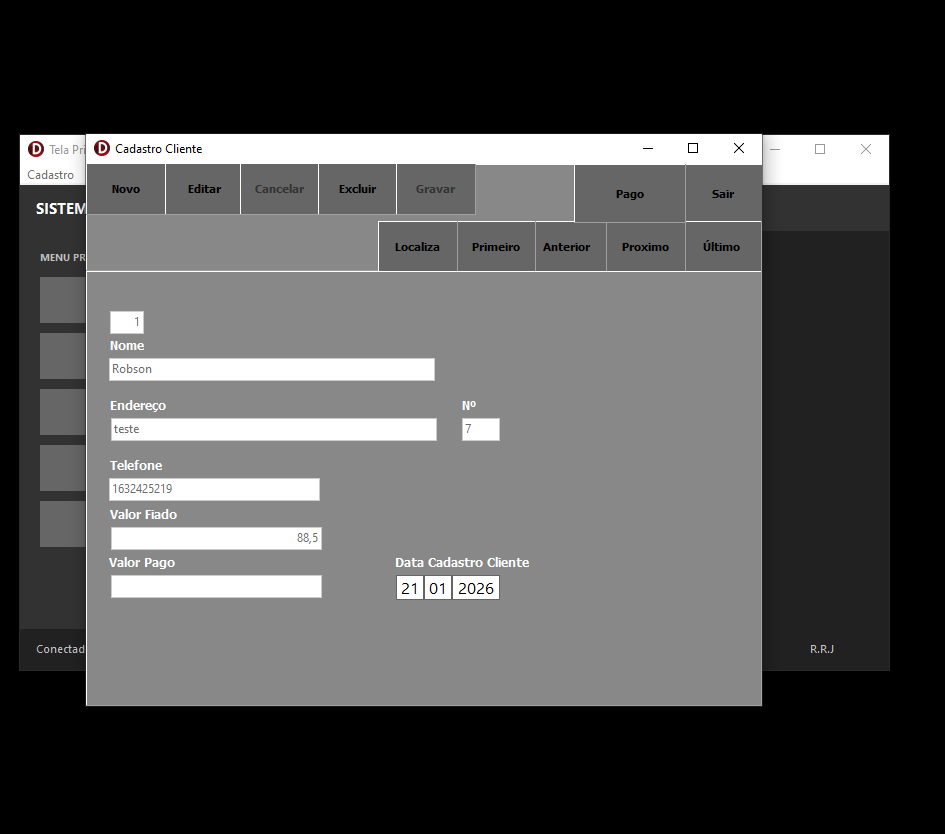
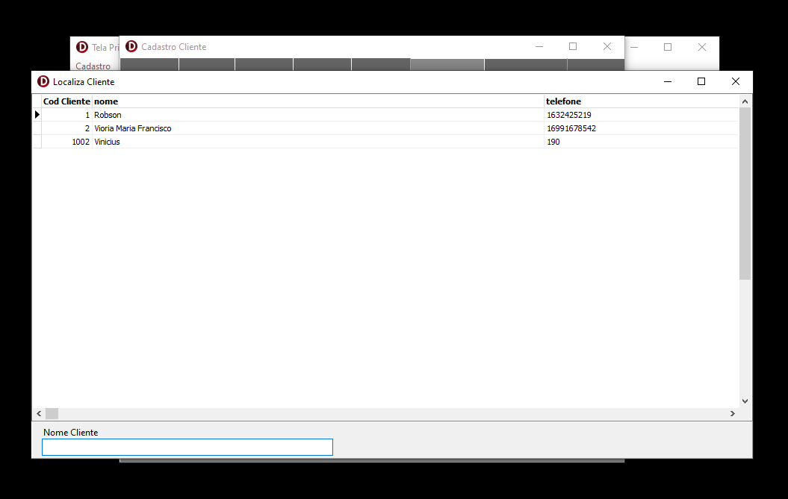
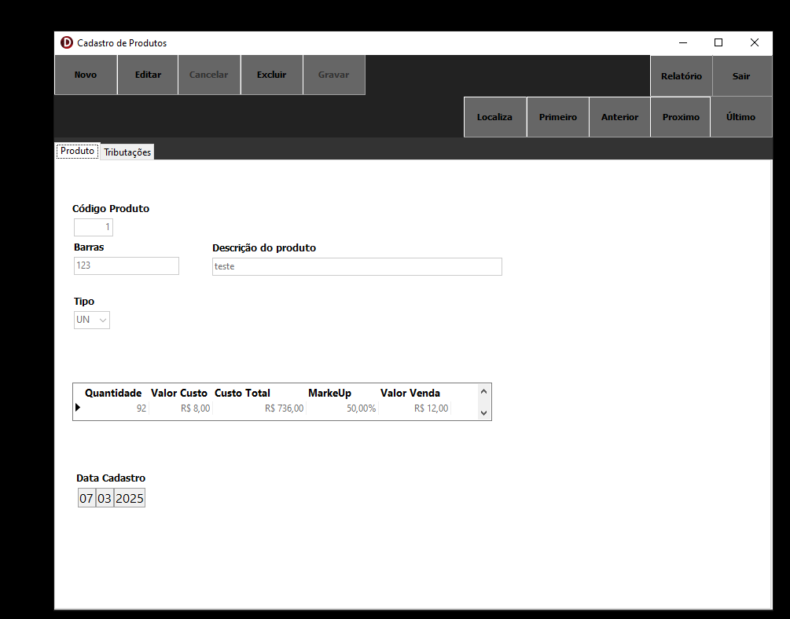
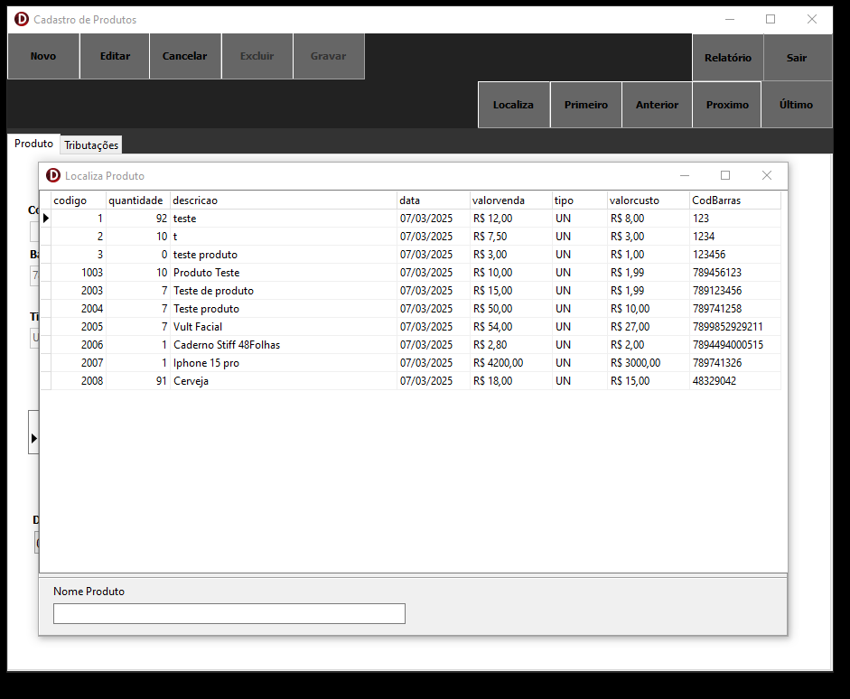
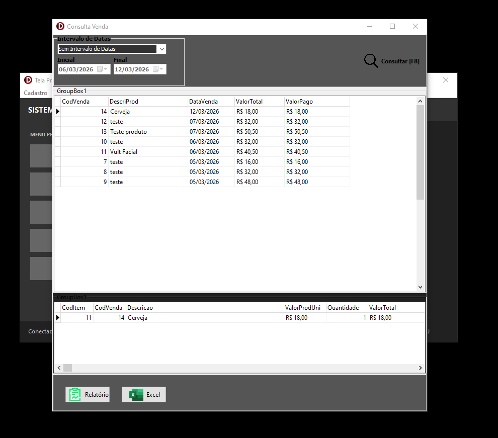
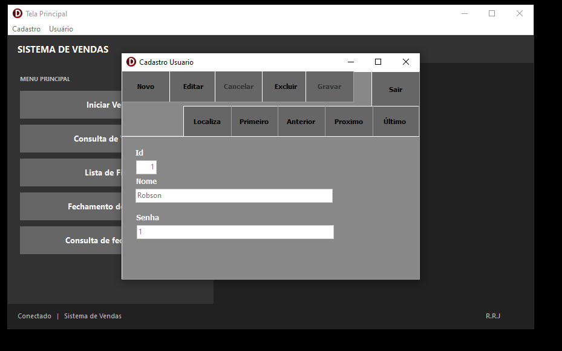

# 🛒 Sistema de Vendas — Desktop

### Sistema completo de gestão comercial desenvolvido em Delphi

> Sistema desktop para gerenciamento de vendas, cadastros e controle de caixa — desenvolvido do zero em Delphi com foco em praticidade para o dia a dia comercial.

---

## 📋 Sobre o Projeto

O **Sistema de Vendas** é uma aplicação desktop desenvolvida em **Delphi / Object Pascal**, voltada para o controle completo de operações comerciais de pequenos e médios negócios. O sistema contempla desde o cadastro de clientes e produtos até o fechamento de caixa, consulta de vendas e controle de fiados.

O projeto está **em funcionamento e em constante evolução**, com novas funcionalidades sendo adicionadas continuamente.

---

## ✨ Funcionalidades

- 🔐 **Login com controle de usuários** — acesso seguro com nome e senha
- 👥 **Cadastro de Clientes** — nome, endereço, telefone, valor fiado e valor pago
- 📦 **Cadastro de Produtos** — código de barras, descrição, tipo, custo, markup e valor de venda
- 🛒 **Caixa de Vendas** — lançamento de itens, venda à vista ou fiado, total em tempo real
- 🔍 **Consulta de Vendas** — filtro por intervalo de datas, exportação para Excel e relatório
- 📊 **Localização de Clientes e Produtos** — busca rápida por nome
- 💰 **Lista de Fiados** — controle de clientes com saldo em aberto
- 🏁 **Fechamento de Caixa** — encerramento e consulta de fechamentos anteriores
- 👤 **Cadastro de Usuários** — gerenciamento de acesso ao sistema

---

## 📸 Telas do Sistema

### 🔐 Tela de Login
> Autenticação com seleção de usuário e senha para acesso ao sistema.

---

### 🏠 Tela Principal
> Menu principal com acesso rápido a todas as funcionalidades. Exibe o status do caixa em tempo real.

---

### 🛒 Caixa de Vendas
> Lançamento de vendas com código de produto (F2), quantidade, valor unitário e total. Suporte a venda normal e fiado.

---

### 👥 Cadastro de Clientes
> Formulário completo com navegação entre registros (Primeiro, Anterior, Próximo, Último) e controle de fiado.

---

### 🔍 Localização de Clientes
> Busca rápida de clientes por nome para agilizar o atendimento no caixa.

---

### 📦 Cadastro de Produtos
> Cadastro com código de barras, tipo, custo, markup automático e valor de venda calculado.

---

### 🔍 Localização de Produtos
> Grid com todos os produtos cadastrados — código, quantidade, descrição, valor de venda e custo.

---

### 📊 Consulta de Vendas
> Relatório de vendas com filtro por data. Exibe detalhamento por item. Exportação para **Excel** e **Relatório PDF**.

---

### 👤 Cadastro de Usuários
> Gerenciamento de usuários com controle de acesso ao sistema.

---

## 🛠️ Tecnologias Utilizadas

| Tecnologia | Uso |
|---|---|
| **Delphi / Object Pascal** | Linguagem principal e IDE |
| **VCL (Visual Component Library)** | Interface gráfica (formulários, grids, botões) |
| **FireDAC** | Conexão e manipulação do banco de dados |
| **Banco de Dados** | Armazenamento de clientes, produtos e vendas |
| **FastReport / QuickReport** | Geração de relatórios e exportação para Excel |

---

## 📌 Roadmap — Próximas Melhorias

- [ ] Relatório de fiados com filtro por cliente
- [ ] Controle de estoque com alerta de quantidade mínima
- [ ] Backup automático do banco de dados
- [ ] Impressão de cupom/recibo de venda
- [ ] Permissões por nível de usuário (admin / operador)

---

## 👨‍💻 Desenvolvedor

**Robson R. J.**
Analista de Sistemas | Desenvolvedor Delphi em formação

---

⭐ *Se este projeto foi útil para você, deixe uma estrela no repositório!*

